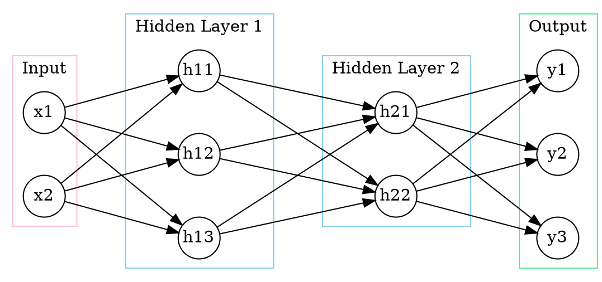

# Assignment 1

#### Sooeun Oh
##### October 8, 2018


### Problem 1
__1.__ ANN with 2 inputs, 2 hidden layers, and 3 outputs:



__2.__ Before the first hidden layer: $W_1 \cdot X + b_1$
$\begin{bmatrix}
w_111 & w_121 \\
w_112 & w_122 \\
w_113 & w_123
\end{bmatrix} \cdot
\begin{bmatrix}
x_11 & x_12 & x_13\\
x_21 & x_22 & x_23
\end{bmatrix} +
\begin{bmatrix}
b_11 \\
b_12 \\
b_13
\end{bmatrix}$
After the first hidden layer: $f(W_1 \cdot X + b_1)$ where $f()$ is ReLu function
In similar manner, we have
Before the second hidden layer: $W_2 \cdot f(W_1 \cdot X + b_1) + b_2$
After the second hidden layer: $f(W_2 \cdot f(W_1 \cdot X + b_1) + b_2)$
Before the output layer: $V \cdot f(W_2 \cdot f(W_1 \cdot X + b_1) + b_2) + c$
After the output layer: $g(V \cdot f(W_2 \cdot f(W_1 \cdot X + b_1) + b_2) + c)$ where $g()$ is softmax function.

__3.__ Python function **ff_nn_2_ReLu()**:

```python
import numpy as np

# Rectified linear activation
def rect(z):
    r = np.fmax(0,z)
    return r

# Softmax function    
def softmax(z):
    s = np.exp(z)/sum(np.exp(z))
    return s

def ff_nn_2_ReLu(X,W1,W2,V,b1,b2,c):
    a1 = np.dot(W1,X)+b1
    h1 = rect(a1)
    a2 = np.dot(W2,h1)+b2
    h2 = rect(a2)
    a3 = np.dot(V,h2)+c
    y = softmax(a3)
    return y
```

__4.__ When we run **ff_nn_2_ReLu()**, we get:

```python
W1 = np.array([[1.,0.],[-1.,0.],[0.,0.5]])
b1 = np.array([[0.,0.,1.]]).T
W2 = np.array([[1.,0.,0.],[-1.,-1.,0.]])
b2 = np.array([[1.,-1.]]).T
V = np.array([[1.,1.],[0.,0.],[-1.,-1.]])
c = np.array([[1.,0.,0.]]).T
X = np.array([[1.,0.,0.],[-1.,-1.,1.]])

output = ff_nn_2_ReLu(X,W1,W2,V,b1,b2,c)
print(output)
```

```
[[0.94649912 0.84379473 0.84379473]
 [0.04712342 0.1141952  0.1141952 ]
 [0.00637746 0.04201007 0.04201007]]
```

Note that each column of the resulting matrix represents the probabilities of each sample belonging to each class (i.e. each row represents class 1, 2, 3). In other words, each column represents the class probabilities associated with the forward pass of each sample and thus, adds up to 1. Since the first row has the largest probabilities for each column, all samples will be classified in class 1.


#### Problem 2
__1.__ The partial derivatives of f with respect to x and to y are:
$\begin{aligned}
\frac{\partial f}{\partial x} &= \frac{\partial}{\partial x} ((1-x)^2+100(y-x^2)^2) = 2(1-x)(-1)+100(2)(y-x^2)(-2x) \\
&= 2(x-1)+2(100(2x^3-2xy)) = 2(x-1)+2(200x^3-200xy) \\
&= 2(200x^3-200xy+x-1) \\ \\
\frac{\partial f}{\partial y} &= \frac{\partial}{\partial y} ((1-x)^2+100(y-x^2)^2) = 100(2)(y-x^2)(1) = 200(y-x^2)
\end{aligned}$

__2.__ The visualization of the contours of the Rosenbrock function:

```python
import numpy as np
import matplotlib.pyplot as plt

delta = 0.025
x = np.arange(-1.5,1.5,delta)
y = np.arange(-1.0,3.0,delta)
X, Y = np.meshgrid(x, y)
Z = (1.-X)**2+100.*(Y-X*X)**2
fig, ax = plt.subplots()
CS = ax.contour(X,Y,Z)
```


__3.__ Gradient Descent algorithm for finding the minimum of the function:

```python
def grad_f(vector):
    x, y = vector
    df_dx = 2*(200*x**3-200*x*y+x-1)
    df_dy = 200*(y-x**2)
    return np.array([df_dx,df_dy])

def grad_descent(iterations, learning_rate):
    point = np.random.uniform(-2,2,size=2)
    trajectory = [point]
    for i in range(iterations):
        grad = grad_f(point)
        point = point-learning_rate*grad
        trajectory.append(point)
    return np.array(trajectory)

np.random.seed(1234)
traj = grad_descent(10,0.004)
fig, ax = plt.subplots()
CS = ax.contour(X,Y,Z)
x = traj[:,0]
y = traj[:,1]
plt.plot(x,y,'-o',x[len(x)-1],y[len(y)-1],'o',1,1,'o')
```


```python
np.random.seed(1234)
traj = grad_descent(1000,0.002)
fig, ax = plt.subplots()
CS = ax.contour(X,Y,Z)
x = traj[:,0]
y = traj[:,1]
plt.plot(x,y,'-o',x[len(x)-1],y[len(y)-1],'o',1,1,'o')
```


```python
np.random.seed(1234)
traj = grad_descent(3000,0.002)
fig, ax = plt.subplots()
CS = ax.contour(X,Y,Z)
x = traj[:,0]
y = traj[:,1]
plt.plot(x,y,'-o',x[len(x)-1],y[len(y)-1],'o',1,1,'o')
```


```python
np.random.seed(1234)
traj = grad_descent(3000,0.001)
fig, ax = plt.subplots()
CS = ax.contour(X,Y,Z)
x = traj[:,0]
y = traj[:,1]
plt.plot(x,y,'-o',x[len(x)-1],y[len(y)-1],'o',1,1,'o')
```


In the first figure, the learning rate is too large and we can clearly see that the optimizer oscillates to find the minimum, but gets stuck in the local minimum just in 10 iterations. As the learning rate decreases to 0.002, it tracks closer to the global minimum point of (1,1). Note that the orange point is the final point after 1000 iterations and the green point is the expected minimum. If we increase the number of iterations as in the third figure, it gets very close to our expected optimal point (i.e. orange point almost overlaps the green point). Lastly, we can see in the last figure that if we decrease the learning rate even more, we would need more iterations compared to the previous example (3000 iterations & 0.002 learning rate) to get closer to the optimal because the step size is smaller.

__4.__ Gradient Descent With Momentum algorithm for finding the minimum:

```python
def grad_descent_with_momentum(iterations, alpha, epsilon):
    point = np.random.uniform(-2,2,size=2)
    trajectory = [point]
    v = np.zeros(point.size)
    for i in range(iterations):
        grad = grad_f(point)
        v = alpha*v+epsilon*grad
        point = point-v
        trajectory.append(point)
    return np.array(trajectory)

np.random.seed(1234)
traj = grad_descent_with_momentum(1000,0.1,0.0005)
fig, ax = plt.subplots()
CS = ax.contour(X,Y,Z)
x = traj[:,0]
y = traj[:,1]
plt.plot(x,y,'-o',x[len(x)-1],y[len(y)-1],'o',1,1,'o')
```


```python
np.random.seed(1234)
traj = grad_descent_with_momentum(1000,0.6,0.0005)
fig, ax = plt.subplots()
CS = ax.contour(X,Y,Z)
x = traj[:,0]
y = traj[:,1]
plt.plot(x,y,'-o',x[len(x)-1],y[len(y)-1],'o',1,1,'o')
```


```python
np.random.seed(1234)
traj = grad_descent_with_momentum(1000,0.8,0.0005)
fig, ax = plt.subplots()
CS = ax.contour(X,Y,Z)
x = traj[:,0]
y = traj[:,1]
plt.plot(x,y,'-o',x[len(x)-1],y[len(y)-1],'o',1,1,'o')
```


```python
np.random.seed(1234)
traj = grad_descent_with_momentum(1000,0.8,0.001)
fig, ax = plt.subplots()
CS = ax.contour(X,Y,Z)
x = traj[:,0]
y = traj[:,1]
plt.plot(x,y,'-o',x[len(x)-1],y[len(y)-1],'o',1,1,'o')
```


Note that as alpha increases, the momentum speeds up the iterations and leads to faster convergence. This behavior is especially more noticeable in the first few iterations of the first, second, and third figures (i.e. as alpha increases, the starting point that the momentum term reduces updates for dimensions whose gradients change directions moves to right). Finally, in the last figure, as the value of epsilon becomes similar to the learning rate from the previous exercise, it gets even closer to the minimum. Therefore, with appropriate value of alpha and epsilon, Gradient Descent with Momentum algorithm finds the minimum in less number of iterations compared to Gradient Descent algorithm. Also, it did not get stuck  in local minimum.


#### Problem 3
__1.__ With same notations from part 1.2, we have
$a_1 = W_1 \cdot X + b_1$
$h_1 = f(W_1 \cdot X + b_1) = f(a_1)$ where $f()$ is ReLu function
$a_2 = W_2 \cdot f(W_1 \cdot X + b_1) + b_2 = W_2 \cdot h_1 + b_2$
$h_2 = f(W_2 \cdot f(W_1 \cdot X + b_1) + b_2) = f(a_2)$
$a_3 = V \cdot f(W_2 \cdot f(W_1 \cdot X + b_1) + b_2) + c = V \cdot h_2 + c$
$\hat{y} = g(V \cdot f(W_2 \cdot f(W_1 \cdot X + b_1) + b_2) + c) = g(a_3)$ where $g()$ is softmax function
and the loss function
$L(y,\hat{y}) = y_1 \log(\hat{y_1}) + y_2 \log(\hat{y_2}) + y_3 \log(\hat{y_3})$.
Therefore, the gradient of the Loss function at each steps are
$\frac{\partial L}{\partial a_3} = \frac{\partial L}{\partial \hat{y}} \frac{\partial \hat{y}}{\partial a_3} = \hat{y}-y$
$\frac{\partial L}{\partial h_2} = \frac{\partial L}{\partial \hat{y}} \frac{\partial \hat{y}}{\partial a_3} \frac{\partial a_3}{\partial h_2} = (\hat{y}-y) \cdot h_2$
$\frac{\partial L}{\partial a_2} = \frac{\partial L}{\partial \hat{y}} \frac{\partial \hat{y}}{\partial a_3} \frac{\partial a_3}{\partial h_2} \frac{\partial h_2}{\partial a_2}= ((\hat{y}-y) \cdot V) (1(h_2>0))$
$\frac{\partial L}{\partial h_1} = \frac{\partial L}{\partial \hat{y}} \frac{\partial \hat{y}}{\partial a_3} \frac{\partial a_3}{\partial h_2} \frac{\partial h_2}{\partial a_2} \frac{\partial a_2}{\partial h_1}= ((((\hat{y}-y) \cdot V) (1(h_2>0))) \cdot W_2)(1(h_1>0))$
$\frac{\partial L}{\partial a_1} = \frac{\partial L}{\partial \hat{y}} \frac{\partial \hat{y}}{\partial a_3} \frac{\partial a_3}{\partial h_2} \frac{\partial h_2}{\partial a_2} \frac{\partial a_2}{\partial h_1} \frac{\partial h_1}{\partial a_1 \text{wrt} w_1}= (((((\hat{y}-y) \cdot V) (1(h_2>0))) \cdot W_2)(1(h_1>0)))\cdot X$

__2.__ Python function **grad_f()**:

```python
import numpy as np
import matplotlib.pyplot as plt

def grad_f(X,W1,W2,V,b1,b2,c,y):
    # rr_nn_2_ReLu from the previous part
    a1 = X.dot(W1.T)+b1.T
    h1 = rect(a1)
    a2 = h1.dot(W2.T)+b2.T
    h2 = rect(a2)
    a3 = h2.dot(V.T)+c.T
    y_hat = softmax(a3)

    # backprop gradient
    da3 = np.array([sum(y_hat-y)]).T
    dh2 = np.dot((y_hat-y).T,h2)
    da2t = np.dot((y_hat-y),V)*(h2>0)
    da2 = np.array([sum(da2t)]).T
    dh1 = np.dot(da2t.T,h1)
    da1t = np.dot(da2t,W2)*(h1>0)
    da1 = np.array([sum(da1t)]).T
    out = np.dot(da1t.T,X)

    return y_hat,[out,da1,dh1,da2,dh2,da3]
```

__3.__  Plot of sample dataset:

```python
np.random.seed(123)
x = np.concatenate(
        (np.random.multivariate_normal(mean=[0,2],cov=[[1,0],[0,1]],size=500),
         np.random.multivariate_normal(mean=[2,-2],cov=[[1,0],[0,1]],size=500),
         np.random.multivariate_normal(mean=[-2,-2],cov=[[1,0],[0,1]],size=500)))
y = np.zeros(1500)
y[500:1000] = 1
y[1000:1500] = 2
plt.scatter(x[:,0], x[:,1], c=y)
```


__4.__ Fit the network using Gradient Descent:

```python
W1 = np.array([[1.,0.],[-1.,0.],[0.,0.5]])
b1 = np.array([[0.,0.,1.]]).T
W2 = np.array([[1.,0.,0.],[-1.,-1.,0.]])
b2 = np.array([[1.,-1.]]).T
V = np.array([[1.,1.],[0.,0.],[-1.,-1.]])
c = np.array([[1.,0.,0.]]).T
y = np.zeros((1500,3))
y[0:500,0] = 1
y[500:1000,1] = 1
y[1000:1500,2] = 1

def rect(z):
    r = np.fmax(0,z)
    return r

def softmax(z):
    s = np.exp(z)/np.array([sum(np.exp(z).T)]).T
    return s

def loss_f(y, y_hat):
    l = np.sum(-y*np.log(y_hat))
    return l

def grad_descent(X,W1,W2,V,b1,b2,c,y,iterations,learning_rate):
    point = [W1,b1,W2,b2,V,c]
    traj = [point]
    loss = [loss_f(y,grad_f(X,W1,W2,V,b1,b2,c,y)[0])]

    for i in range(iterations):
        y_hat,grad = grad_f(X,W1,W2,V,b1,b2,c,y)
        point = np.subtract(point, [j*learning_rate for j in grad])
        traj.append(point)
        W1,b1,W2,b2,V,c = [point[k] for k in range(len(point))]
        loss.append(loss_f(y,grad_f(X,W1,W2,V,b1,b2,c,y)[0]))

    return (np.array(traj), loss)

traj1,loss1 = grad_descent(x,W1,W2,V,b1,b2,c,y,20,0.0005)
traj2,loss2 = grad_descent(x,W1,W2,V,b1,b2,c,y,20,0.005)
traj3,loss3 = grad_descent(x,W1,W2,V,b1,b2,c,y,20,0.05)

plt.plot(loss1,'o',label='learning rate=0.0005')
plt.plot(loss2,'o',label='learning rate=0.005')
plt.plot(loss3,'o',label='learning rate=0.05')
plt.legend(framealpha=1, frameon=True)
plt.xlabel("Iterations")
plt.ylabel("RMS Error")
```


When the learning rate is too large, we can actually see RMS error oscillating and it takes some time to converge, but RMS error is still very high. As the learning rate decreases and becomes an appropriate tuning parameter, the error stably converges (almost linear after first few iterations) to a smaller rate.

__5.__ Fit the network using Gradient Descent With Momentum:

```python
def grad_descent_with_momentum(X,W1,W2,V,b1,b2,c,y,iterations,alpha,epsilon):
    point = [W1,b1,W2,b2,V,c]
    traj = [point]
    v = [np.zeros(np.shape(i)) for i in point]
    loss = [loss_f(y,grad_f(X,W1,W2,V,b1,b2,c,y)[0])]

    for i in range(iterations):
        y_hat,grad = grad_f(X,W1,W2,V,b1,b2,c,y)
        v = np.add([alpha*j for j in v], [epsilon*k for k in grad])
        point = point - v
        traj.append(point)
        W1,b1,W2,b2,V,c = [point[k] for k in range(len(point))]
        loss.append(loss_f(y,grad_f(X,W1,W2,V,b1,b2,c,y)[0]))

    return (np.array(traj), loss)

traj1,loss1 = grad_descent_with_momentum(x,W1,W2,V,b1,b2,c,y,50,0.5,0.002)
traj2,loss2 = grad_descent_with_momentum(x,W1,W2,V,b1,b2,c,y,50,0.5,0.004)
traj3,loss3 = grad_descent_with_momentum(x,W1,W2,V,b1,b2,c,y,50,0.5,0.006)

plt.plot(loss1,'o',label='epsilon=0.002')
plt.plot(loss2,'o',label='epsilon=0.004')
plt.plot(loss3,'o',label='epsilon=0.006')
plt.legend(framealpha=1, frameon=True)
plt.xlabel("Iterations")
plt.ylabel("RMS Error")
```


```python
traj1,loss1 = grad_descent_with_momentum(x,W1,W2,V,b1,b2,c,y,50,0.1,0.001)
traj2,loss2 = grad_descent_with_momentum(x,W1,W2,V,b1,b2,c,y,50,0.5,0.001)
traj3,loss3 = grad_descent_with_momentum(x,W1,W2,V,b1,b2,c,y,50,0.9,0.001)

plt.plot(loss1,'o',label='alpha=0.01')
plt.plot(loss2,'o',label='alpha=0.05')
plt.plot(loss3,'o',label='alpha=0.09')
plt.legend(framealpha=1, frameon=True)
plt.xlabel("Iterations")
plt.ylabel("RMS Error")
```


Again, we see similar behavior as alpha and epsilon change respectively. Both algorithms converge quite efficiently if appropriate parameters are selected. Thus, it is always crucial to find appropriate tuning parameters for both methods. However, with momentum, RMS error converges in a path like the trajectory of bouncing ball. Instead of converging after zig-zagging in a constant step size, this could be less waste of iterations and thus, more efficient.
